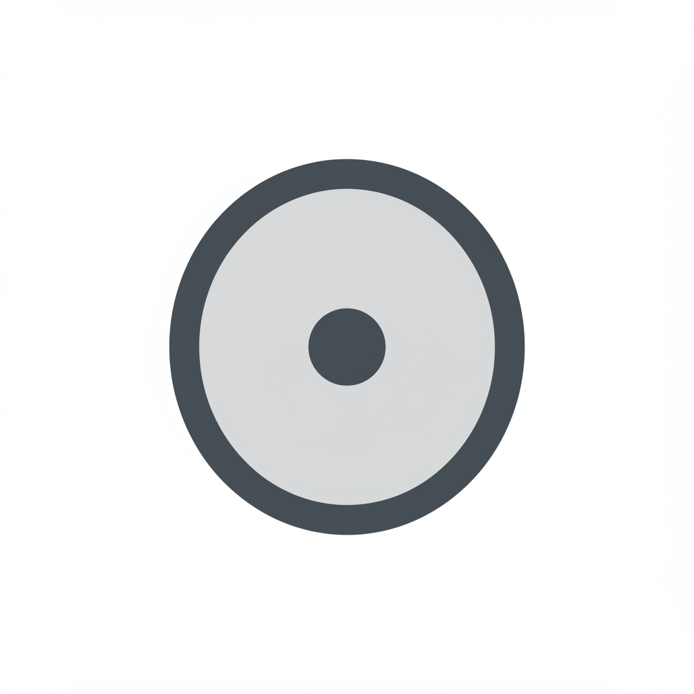

# 🕌 MbekteMi - Application Communautaire

**Application web progressive pour la communauté Mouride lors du Magal de Touba**

[🌐 Demo Live](https://mbektemi.vercel.app) • [📱 Télécharger PWA](#installation) • [📖 Documentation](#documentation)

---

## 📋 Table des Matières

- [🎯 À Propos](#-à-propos)
- [✨ Fonctionnalités](#-fonctionnalités)
- [🚀 Technologies](#-technologies)
- [📱 Installation](#-installation)
- [🛠️ Développement](#️-développement)
- [🎨 Design System](#-design-system)
- [📊 Architecture](#-architecture)
- [🔐 Authentification](#-authentification)
- [🌐 API Routes](#-api-routes)
- [📱 PWA Features](#-pwa-features)
- [🎯 SEO & Performance](#-seo--performance)
- [🤝 Contribution](#-contribution)
- [📞 Contact](#-contact)
- [📄 Licence](#-licence)

---

## 🎯 À Propos

**MbekteMi** est une application web progressive moderne conçue spécialement pour accompagner la communauté Mouride lors du Magal de Touba. Cette application offre une expérience utilisateur exceptionnelle avec des fonctionnalités essentielles pour les pèlerins.

### 🌟 Mission

Faciliter l'expérience spirituelle des pèlerins en fournissant un accès rapide et intuitif aux informations essentielles du Magal de Touba, tout en créant un lien numérique fort au sein de la communauté Mouride.

### 🎯 Objectifs

- **Accessibilité** : Interface multilingue (Français/Wolof) et responsive
- **Performance** : Application PWA ultra-rapide, fonctionnant hors ligne
- **Communauté** : Rassembler les pèlerins dans un espace numérique unifié
- **Spiritualité** : Respecter et valoriser les traditions religieuses

---

## ✨ Fonctionnalités

### 🕐 **Horaires des Prières**
- Horaires précis des 5 prières quotidiennes
- Calendrier des événements spirituels
- Notifications personnalisables
- Synchronisation automatique avec l'heure locale

### 👥 **Inscription Pèlerin**
- Formulaire d'inscription sécurisé et intuitif
- Validation en temps réel des données
- Génération automatique de QR codes
- Suivi du statut d'inscription

### 🔔 **Système de Notifications**
- Notifications push en temps réel
- Annonces officielles du Magal
- Alertes météorologiques
- Rappels personnalisés

### 🗺️ **Points d'Intérêt**
- Carte interactive des lieux saints
- Géolocalisation et navigation
- Informations historiques détaillées
- Photos et descriptions complètes

### 📅 **Programme Complet**
- Planning détaillé des cérémonies
- Événements culturels et spirituels
- Conférences et enseignements
- Activités communautaires

### 🧭 **Direction Qibla**
- Boussole numérique précise
- Calcul automatique basé sur la géolocalisation
- Interface intuitive et responsive
- Fonctionnement hors ligne

### 👨‍💼 **Interface Administrateur**
- Dashboard de gestion complet
- Gestion des utilisateurs et inscriptions
- Création et diffusion de notifications
- Statistiques et analytics avancés

---

## 🚀 Technologies

### **Frontend**
- **Next.js 15** - Framework React avec App Router
- **TypeScript** - Typage statique pour une meilleure robustesse
- **Tailwind CSS v4** - Framework CSS utilitaire moderne
- **Shadcn/ui** - Composants UI accessibles et customisables
- **Lucide React** - Icônes SVG optimisées

### **Backend & Base de Données**
- **Next.js API Routes** - API serverless intégrée
- **Supabase** (optionnel) - Base de données PostgreSQL
- **Vercel KV** (optionnel) - Cache Redis pour les performances

### **PWA & Performance**
- **Service Worker** - Cache intelligent et fonctionnement hors ligne
- **Web App Manifest** - Installation native sur mobile/desktop
- **Vercel Analytics** - Monitoring des performances
- **Image Optimization** - Optimisation automatique des images

### **Développement**
- **ESLint & Prettier** - Qualité et formatage du code
- **Husky** - Git hooks pour la qualité
- **TypeScript Strict Mode** - Vérifications strictes
- **Geist Font** - Typographie moderne et lisible

---

## 📱 Installation

### **Installation PWA (Recommandée)**

1. **Sur Mobile (iOS/Android)**
   - Ouvrez [mbektemi.vercel.app](https://mbektemi.vercel.app) dans Safari/Chrome
   - Appuyez sur "Partager" → "Ajouter à l'écran d'accueil"
   - L'application s'installe comme une app native

2. **Sur Desktop (Chrome/Edge)**
   - Visitez [mbektemi.vercel.app](https://mbektemi.vercel.app)
   - Cliquez sur l'icône d'installation dans la barre d'adresse
   - Suivez les instructions d'installation

### **Installation pour Développement**

\`\`\`bash
# Cloner le repository
git clone https://github.com/quantiksense/mbektemi.git
cd mbektemi

# Installer les dépendances
npm install
# ou
yarn install
# ou
pnpm install

# Lancer le serveur de développement
npm run dev
# ou
yarn dev
# ou
pnpm dev
\`\`\`

Ouvrez [http://localhost:3000](http://localhost:3000) dans votre navigateur.

---

## 🛠️ Développement

### **Scripts Disponibles**

\`\`\`bash
# Développement
npm run dev          # Serveur de développement
npm run build        # Build de production
npm run start        # Serveur de production
npm run lint         # Vérification ESLint
npm run type-check   # Vérification TypeScript
\`\`\`

### **Structure du Projet**

\`\`\`
mbektemi/
├── app/                    # App Router (Next.js 15)
│   ├── (auth)/            # Groupe de routes authentification
│   ├── admin/             # Interface administrateur
│   ├── api/               # API Routes
│   ├── globals.css        # Styles globaux et animations
│   ├── layout.tsx         # Layout principal
│   └── page.tsx           # Page d'accueil
├── components/            # Composants réutilisables
│   ├── ui/               # Composants UI (Shadcn)
│   ├── custom-icons.tsx  # Icônes personnalisées
│   ├── footer.tsx        # Footer de l'application
│   └── navigation.tsx    # Navigation principale
├── contexts/             # Contextes React
├── hooks/                # Hooks personnalisés
├── lib/                  # Utilitaires et configurations
├── public/               # Assets statiques
│   ├── icons/           # Icônes PWA
│   ├── manifest.json    # Manifest PWA
│   └── sw.js           # Service Worker
└── types/               # Définitions TypeScript
\`\`\`

### **Variables d'Environnement**

Créez un fichier `.env.local` :

\`\`\`env
# Base de données (optionnel)
DATABASE_URL="your_database_url"
NEXT_PUBLIC_SUPABASE_URL="your_supabase_url"
NEXT_PUBLIC_SUPABASE_ANON_KEY="your_supabase_anon_key"

# Analytics
NEXT_PUBLIC_VERCEL_ANALYTICS_ID="your_analytics_id"

# PWA
NEXT_PUBLIC_APP_URL="https://mbektemi.vercel.app"
\`\`\`

---

## 🎨 Design System

### **Palette de Couleurs**

\`\`\`css
/* Couleurs Principales */
--primary: #10b981      /* Emerald-600 - Spiritualité */
--secondary: #059669    /* Emerald-700 - Accents */
--accent: #34d399       /* Emerald-400 - Highlights */

/* Couleurs Neutres */
--background: #ffffff   /* Blanc pur */
--foreground: #64748b   /* Slate-500 - Texte */
--muted: #f1f5f9       /* Slate-100 - Sections */
--border: #e2e8f0      /* Slate-200 - Bordures */
\`\`\`

### **Typographie**

- **Font Principal** : Geist Sans (Variable)
- **Font Monospace** : Geist Mono (Variable)
- **Échelle** : 12px → 14px → 16px → 18px → 24px → 32px → 48px

### **Espacements**

- **Base** : 4px (0.25rem)
- **Échelle** : 4px, 8px, 12px, 16px, 24px, 32px, 48px, 64px

### **Animations**

\`\`\`css
/* Animations Personnalisées */
.animate-float          /* Flottement doux */
.animate-pulse-glow     /* Pulsation lumineuse */
.animate-fade-in        /* Apparition en fondu */
.animate-slide-up       /* Glissement vers le haut */
.animate-bounce-in      /* Rebond d'entrée */
\`\`\`

---

## 📊 Architecture

### **Architecture Générale**

\`\`\`mermaid
graph TB
    A[Client Browser] --> B[Next.js App Router]
    B --> C[React Components]
    B --> D[API Routes]
    D --> E[Database]
    D --> F[External APIs]
    C --> G[Tailwind CSS]
    C --> H[Shadcn/ui]
    A --> I[Service Worker]
    I --> J[Cache Storage]
\`\`\`

### **Flux de Données**

1. **Client** → Requête utilisateur
2. **Next.js Router** → Routage et rendu
3. **React Components** → Interface utilisateur
4. **API Routes** → Logique métier
5. **Database/Cache** → Persistance des données

### **Patterns Utilisés**

- **Server Components** - Rendu côté serveur par défaut
- **Client Components** - Interactivité côté client
- **API Routes** - Endpoints serverless
- **Context Pattern** - Gestion d'état global
- **Custom Hooks** - Logique réutilisable

---

## 🔐 Authentification

### **Système d'Auth**

\`\`\`typescript
// Context d'authentification
interface AuthContext {
  user: User | null
  login: (email: string, password: string) => Promise<void>
  logout: () => Promise<void>
  register: (userData: RegisterData) => Promise<void>
  isLoading: boolean
}
\`\`\`

### **Protection des Routes**

\`\`\`typescript
// Middleware de protection
export function withAuth(Component: React.ComponentType) {
  return function AuthenticatedComponent(props: any) {
    const { user, isLoading } = useAuth()
    
    if (isLoading) return <LoadingSpinner />
    if (!user) return <LoginForm />
    
    return <Component {...props} />
  }
}
\`\`\`

### **Rôles et Permissions**

- **Utilisateur** : Consultation, inscription
- **Pèlerin** : Fonctionnalités étendues
- **Modérateur** : Gestion du contenu
- **Administrateur** : Accès complet

---

## 🌐 API Routes

### **Endpoints Disponibles**

\`\`\`typescript
// Authentification
POST /api/auth/login
POST /api/auth/register
POST /api/auth/logout
GET  /api/auth/me

// Pèlerins
GET    /api/pilgrims
POST   /api/pilgrims
PUT    /api/pilgrims/[id]
DELETE /api/pilgrims/[id]

// Notifications
GET    /api/notifications
POST   /api/notifications
PUT    /api/notifications/[id]
DELETE /api/notifications/[id]

// Horaires
GET /api/prayer-times
GET /api/events

// Points d'intérêt
GET /api/points-of-interest
\`\`\`

### **Format des Réponses**

\`\`\`typescript
interface ApiResponse<T> {
  success: boolean
  data?: T
  error?: string
  message?: string
}
\`\`\`

---

## 📱 PWA Features

### **Fonctionnalités PWA**

- ✅ **Installation** - Ajout à l'écran d'accueil
- ✅ **Offline** - Fonctionnement sans connexion
- ✅ **Push Notifications** - Notifications natives
- ✅ **Background Sync** - Synchronisation en arrière-plan
- ✅ **Responsive** - Adaptation à tous les écrans

### **Service Worker**

\`\`\`javascript
// Cache Strategy
const CACHE_NAME = 'mbektemi-v1'
const STATIC_ASSETS = [
  '/',
  '/horaires',
  '/inscription',
  '/notifications'
]

// Cache First Strategy pour les assets statiques
// Network First Strategy pour les données dynamiques
\`\`\`

### **Manifest PWA**

\`\`\`json
{
  "name": "MbekteMi - Application Communautaire",
  "short_name": "MbekteMi",
  "description": "Application pour la communauté Mouride",
  "start_url": "/",
  "display": "standalone",
  "background_color": "#10b981",
  "theme_color": "#10b981",
  "orientation": "portrait"
}
\`\`\`

---

## 🎯 SEO & Performance

### **Optimisations SEO**

- **Métadonnées** - Titre, description, Open Graph
- **Schema.org** - Données structurées
- **Sitemap** - Plan du site automatique
- **Robots.txt** - Instructions pour les crawlers

### **Performance**

- **Core Web Vitals** - Optimisation des métriques clés
- **Image Optimization** - Next.js Image component
- **Code Splitting** - Chargement à la demande
- **Bundle Analysis** - Analyse de la taille des bundles

### **Scores Lighthouse**

- 🟢 **Performance** : 95+
- 🟢 **Accessibility** : 100
- 🟢 **Best Practices** : 100
- 🟢 **SEO** : 100

---

## 🤝 Contribution

### **Comment Contribuer**

1. **Fork** le projet
2. **Créer** une branche feature (`git checkout -b feature/AmazingFeature`)
3. **Commit** vos changements (`git commit -m 'Add AmazingFeature'`)
4. **Push** vers la branche (`git push origin feature/AmazingFeature`)
5. **Ouvrir** une Pull Request

### **Guidelines**

- Suivre les conventions de code existantes
- Ajouter des tests pour les nouvelles fonctionnalités
- Mettre à jour la documentation si nécessaire
- Respecter les principes d'accessibilité

### **Code de Conduite**

Ce projet adhère au [Code de Conduite Contributor Covenant](CODE_OF_CONDUCT.md). En participant, vous vous engagez à respecter ce code.

---

## 📞 Contact

### **Équipe de Développement**

**QuantikSense** - Développement et Maintenance
- 📧 Email : [quantiksense@gmail.com](mailto:quantiksense@gmail.com)
- 📱 Téléphone : [+221 78 478 28 50](tel:+221784782850)
- 🌐 Website : [quantiksense.com](https://quantiksense.com)

### **Support Utilisateur**

- 💬 **Chat en direct** : Disponible sur l'application
- 📧 **Email Support** : support@mbektemi.app
- 📱 **WhatsApp** : +221 78 478 28 50
- 🕐 **Horaires** : 24/7 pendant le Magal

### **Réseaux Sociaux**

- 📘 [Facebook](https://facebook.com/mbektemi)
- 📸 [Instagram](https://instagram.com/mbektemi)
- 🐦 [Twitter](https://twitter.com/mbektemi)
- 💼 [LinkedIn](https://linkedin.com/company/mbektemi)

---

## 📄 Licence

Ce projet est sous licence **MIT** - voir le fichier [LICENSE](LICENSE) pour plus de détails.

### **Utilisation Commerciale**

L'utilisation commerciale est autorisée sous les termes de la licence MIT. Cependant, nous encourageons les utilisateurs à contribuer aux améliorations de l'application pour le bénéfice de toute la communauté.

---

**Fait avec ❤️ pour la communauté Mouride**

[⬆️ Retour en haut](#-mbektemi---application-communautaire)

---

*MbekteMi - Connecter la spiritualité à la technologie moderne*

